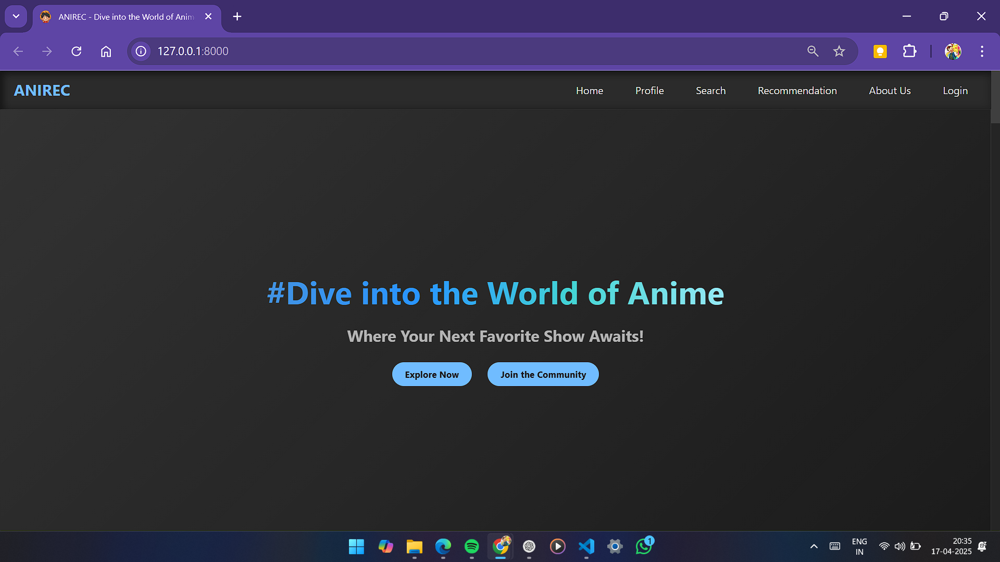
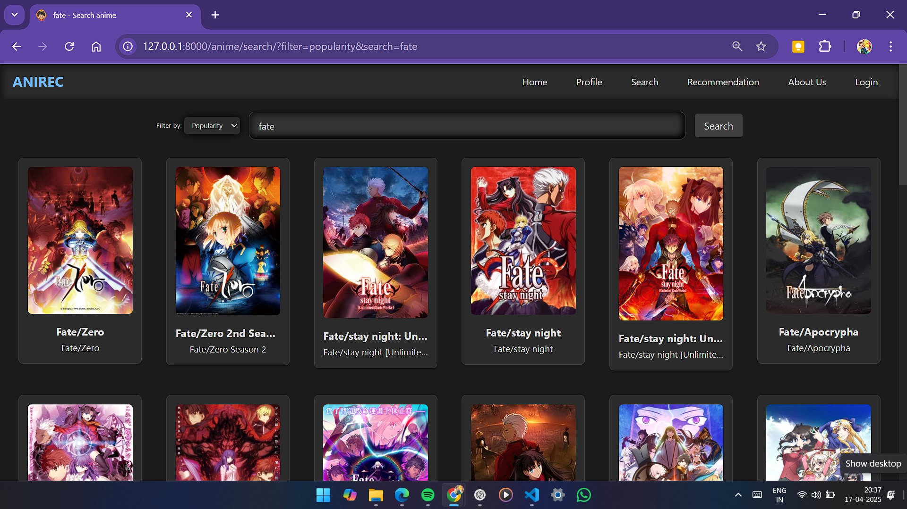
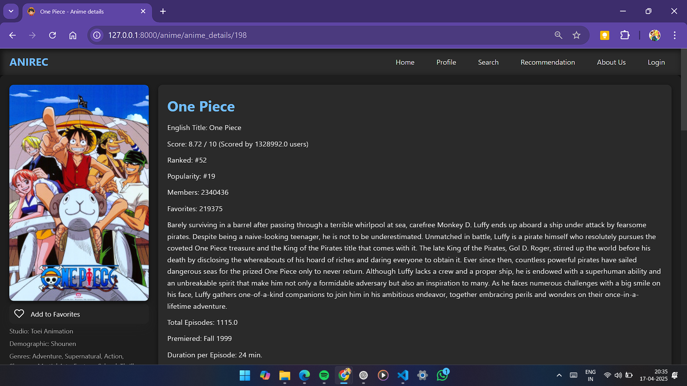
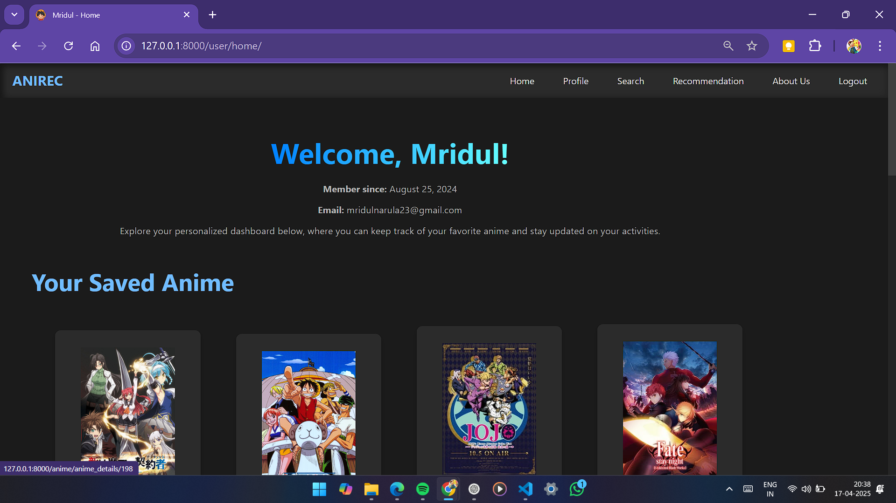
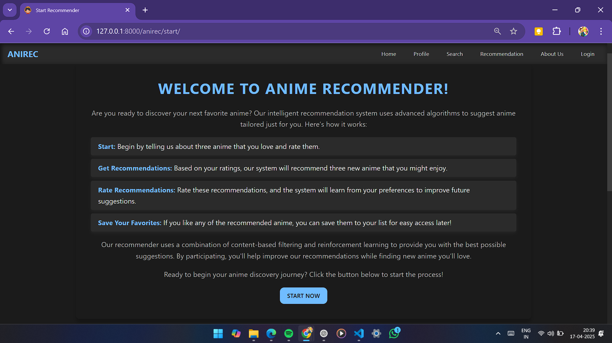

# ANIREC Web

> A Django server-side rendered anime discovery and personalized recommendation platform powered by content-based similarity and a UCB multi-armed bandit recommender.

ANIREC Web is the web version of the original ANIREC anime recommender system. It combines an anime catalog, search and discovery features, user accounts, favorites, anime similarity recommendations, and an interactive personalized recommendation workflow.

The application is built with **Django SSR, HTML templates, CSS, and JavaScript**, while the recommendation engine uses a precomputed similarity matrix and an **Upper Confidence Bound (UCB)** multi-armed bandit algorithm.

---

## ✨ Features

### 🔎 Anime Discovery

- Browse an anime catalog with poster artwork and metadata.
- Search by anime title.
- Sort/filter search results by fields such as popularity.
- Paginated search results.
- Dedicated anime detail pages.
- View similar anime based on content similarity.
- Browse curated/homepage anime sections.

### 🤖 Personalized Recommendations

ANIREC's interactive recommender starts with three anime selected by the user.

1. Select three anime you like.
2. Give each anime a rating from **1–5**.
3. The system initializes three recommendation arms.
4. A UCB policy chooses which arm to exploit/explore.
5. The selected arm produces three new anime using the similarity matrix.
6. Rate the recommendations.
7. The ratings become feedback for the selected arm.
8. The process repeats, adapting future recommendations to the user's feedback.

### 👤 User Accounts

- User registration.
- Login/logout.
- Authenticated user dashboard.
- Saved/favorite anime.
- Toggle anime in and out of the saved list.

### 🎨 Web Interface

- Django server-side rendered pages.
- Dark-themed interface.
- Reusable navigation/layout templates.
- Custom CSS and JavaScript for the anime, recommendation, and user sections.
- Anime poster/image presentation throughout the application.

---

## 🧠 Recommendation System

ANIREC Web uses two related recommendation mechanisms.

### 1. Content-Based Similarity

Anime similarity is calculated from a precomputed similarity matrix.

When an anime detail page is opened, ANIREC finds similar anime using the anime's corresponding row in the similarity matrix and returns the highest-ranked candidates.

The similarity matrix is stored locally as:

```text
similarity_matrix.pkl
```

The application uses this matrix rather than recomputing the full similarity calculation for every request.

### 2. UCB Multi-Armed Bandit

The personalized recommender uses **Upper Confidence Bound (UCB)** to choose between three recommendation arms.

Each arm stores:

- Anime associated with that arm
- Ratings received by recommendations from that arm
- Number of times the arm has been selected

The UCB score is calculated as:

```text
UCB = average_rating + sqrt(2 * ln(round_no) / t)
```

where:

- `average_rating` = average feedback received by the arm
- `round_no` = current recommendation round
- `t` = number of times the arm has been selected

The arm with the highest UCB score is selected.

This provides a balance between:

- **Exploitation** — favoring arms that have received better ratings.
- **Exploration** — giving less-selected arms an opportunity to perform better.

The selected arm then uses content similarity to generate candidate anime, removes titles already recommended to the user, and returns three new recommendations.

---

## 🛠️ Technology Stack

### Backend

- **Python**
- **Django 5.1**
- Django ORM
- Django authentication
- Django sessions
- SQLite

### Recommendation / Data Processing

- **NumPy**
- **Pandas**
- Precomputed similarity matrix
- UCB multi-armed bandit

### Frontend

- HTML
- Django Templates
- CSS
- JavaScript

### Deployment Interfaces

Django WSGI and ASGI entry points are included for deployment/server integration.

---

## 🚀 Installation

### 1. Clone the repository

```bash
git clone https://github.com/Mridul-23/Anirec_w.git
cd Anirec_w
```

### 2. Create a virtual environment

Windows:

```bash
python -m venv venv
venv\Scripts\activate
```

macOS/Linux:

```bash
python3 -m venv venv
source venv/bin/activate
```

### 3. Install dependencies

```bash
pip install -r requirements.txt
```

### 4. Apply migrations

```bash
python manage.py migrate
```

### 5. Start the development server

```bash
python manage.py runserver
```

Open:

```text
http://127.0.0.1:8000/
```

---

## 📦 Required Data / Model Files

The web application relies on a precomputed similarity matrix:

```text
similarity_matrix.pkl
```

This file is loaded by the recommendation code to retrieve anime similarity values.

---

## ⚙️ Data Import

The `anime` application includes custom Django management commands for importing anime data and images:

```text
anime/management/commands/
├── import_anime.py
└── import_images.py
```

If the repository includes the source data required by these commands, the commands can be used to populate the Django database and associated anime images.

---

## 🖥️ Screenshots

### Landing Page

The landing page introduces ANIREC and provides entry points for anime discovery and the recommendation experience.



### Anime Search

Search anime by title and browse results using sorting/filtering controls.



### Anime Details

Anime detail pages present metadata, synopsis, poster artwork, and similar anime.



### User Dashboard

Authenticated users can view their profile information and saved anime.



### Personalized Recommender

The recommendation workflow collects initial preferences and uses user ratings as feedback for subsequent recommendations.



> **Screenshot setup:** create `docs/screenshots/` in the repository and place the corresponding screenshots there using the filenames shown above.

---

## 📁 Project Structure

```text
.
├── anime/
│   ├── management/
│   │   └── commands/
│   │       ├── import_anime.py
│   │       └── import_images.py
│   ├── static/
│   │   └── anime/
│   │       ├── css/
│   │       ├── images/
│   │       └── js/
│   ├── templates/
│   │   └── anime/
│   ├── admin.py
│   ├── apps.py
│   ├── contentfilter.py
│   ├── models.py
│   ├── urls.py
│   └── views.py
│
├── anirec/
│   ├── static/
│   │   └── anirec/
│   │       ├── css/
│   │       └── js/
│   ├── templates/
│   │   └── anirec/
│   ├── admin.py
│   ├── apps.py
│   ├── models.py
│   ├── recommender.py
│   ├── session_helpers.py
│   ├── urls.py
│   └── views.py
│
├── anirec_w/
│   ├── asgi.py
│   ├── settings.py
│   ├── urls.py
│   └── wsgi.py
│
├── user/
│   ├── static/
│   │   └── user/
│   │       ├── css/
│   │       └── js/
│   ├── templates/
│   │   └── user/
│   ├── admin.py
│   ├── apps.py
│   ├── forms.py
│   ├── models.py
│   ├── urls.py
│   └── views.py
│
├── db.sqlite3
├── similarity_matrix.pkl
├── manage.py
├── requirements.txt
└── .gitignore
```

---

## 🤝 Contributing

Contributions are welcome.

1. Fork the repository.
2. Create a feature branch.
3. Make your changes.
4. Test the application.
5. Commit your changes.
6. Push the branch.
7. Open a pull request.

---

## 📄 License

This project is licensed under the **MIT License**.

See the [LICENSE](LICENSE) file for details.

---

## 👨‍💻 Author

**Mridul Narula**

Original ANIREC project:

`https://github.com/Mridul-23/Anirec`
